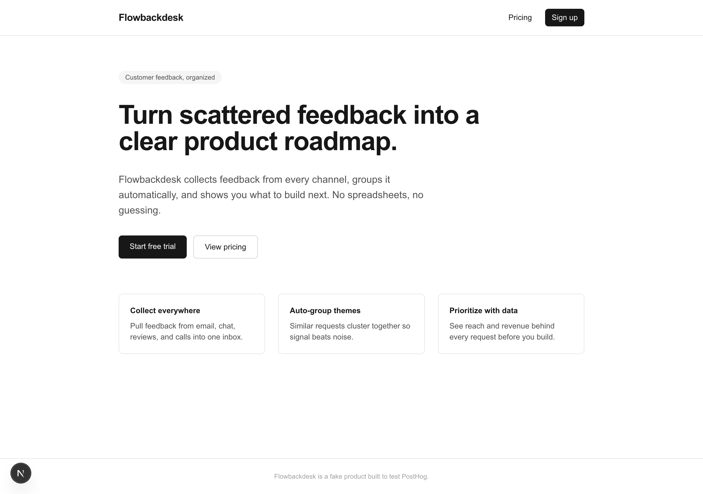
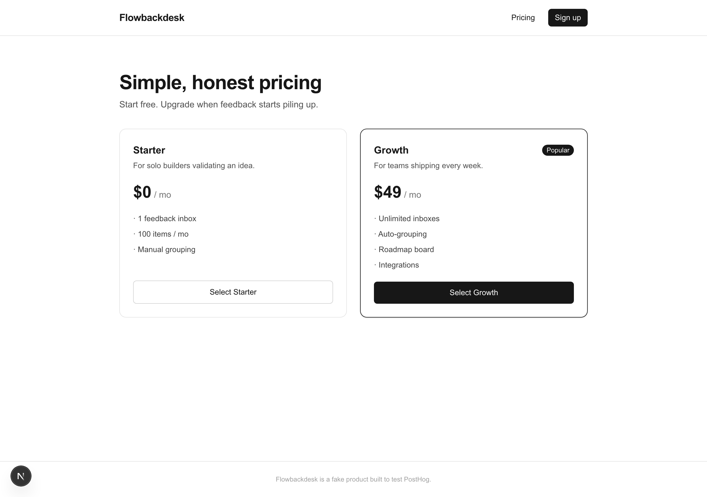
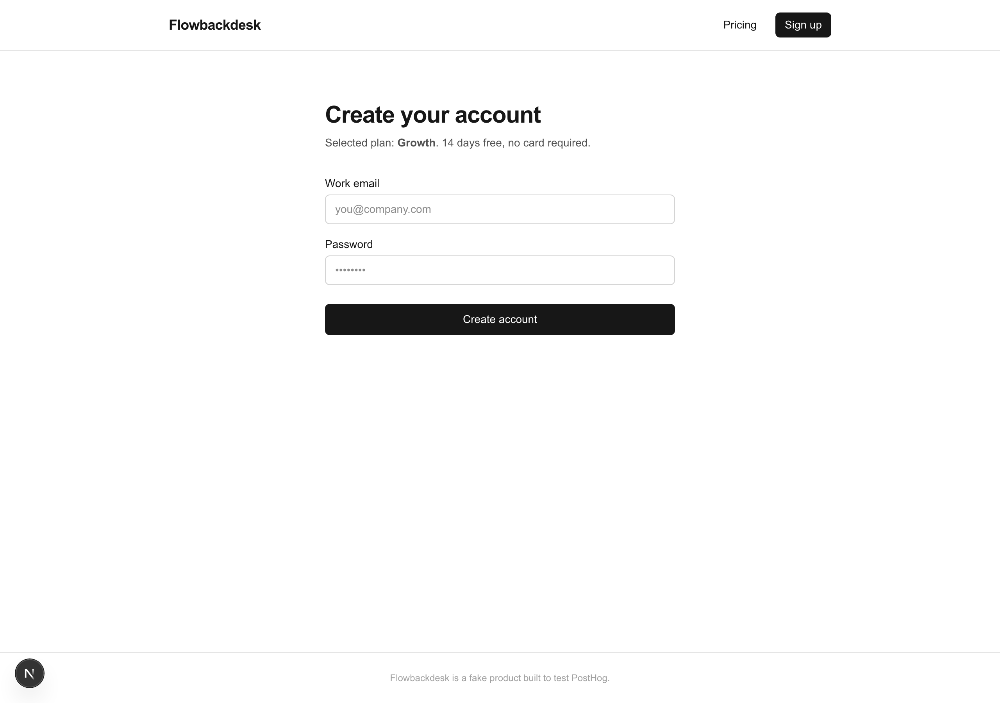

# Flowbackdesk

A mock SaaS app I built to try the [PostHog](https://posthog.com) setup wizard hands-on.

I wanted to see the PostHog onboarding for myself, hands-on. My main site, [Marketing In Action](https://marketinginaction.xyz), is a static HTML site rather than a framework app, so the PostHog wizard had nothing to work with. The wizard (`npx @posthog/wizard`) targets framework projects like Next.js, React, Vue, and Django, and a static site gives it no framework to detect and no package manager to install into. So instead of forcing it onto MIA, I scaffolded a throwaway Next.js app, gave it a fake product identity (Flowbackdesk), and ran the wizard against that to experience the full setup.

Flowbackdesk is not a real product. The name is invented and the app exists only to generate analytics events.

---

## What it is

A three-page mock SaaS funnel built with Next.js 16 (App Router, Turbopack) and Tailwind. The pages follow a real conversion path (landing, then pricing, then signup), so the captured events form a funnel worth analyzing.

**Landing** (`/`): hero with two call-to-action buttons

**Pricing** (`/pricing`): two plan cards that carry the chosen plan into signup

**Signup** (`/signup`): email and password form with a success state

---

## What the PostHog wizard set up

Running `npx -y @posthog/wizard@latest` from the project root handled the whole integration:

- Installed `posthog-js` and created `instrumentation-client.ts` to initialize PostHog

- Wrote the project key into `.env.local` (gitignored, so it is not in this repo)

- Added a `/ingest` reverse proxy in `next.config.ts` so events still send when ad blockers are present

- Enabled autocapture for pageviews and clicks with no manual code

- Wired three custom events and identified the user on signup

| Event | Where it fires | Properties |
|-------|----------------|------------|
| `cta_clicked` | Landing page CTAs | `cta_label`, `destination` |
| `plan_selected` | Pricing plan cards | `plan` |
| `signup_completed` | Signup form submit | `plan`, `email` |

`posthog.identify(email)` runs on signup so the events attach to a person rather than an anonymous visitor.

---

## About

Built by [James Praise](https://www.jamespraise.xyz), founder of [Marketing In Action](https://marketinginaction.xyz).

- LinkedIn: [linkedin.com/in/jamespraise](https://www.linkedin.com/in/jamespraise)
- X: [x.com/realjaymes](https://x.com/realjaymes)
